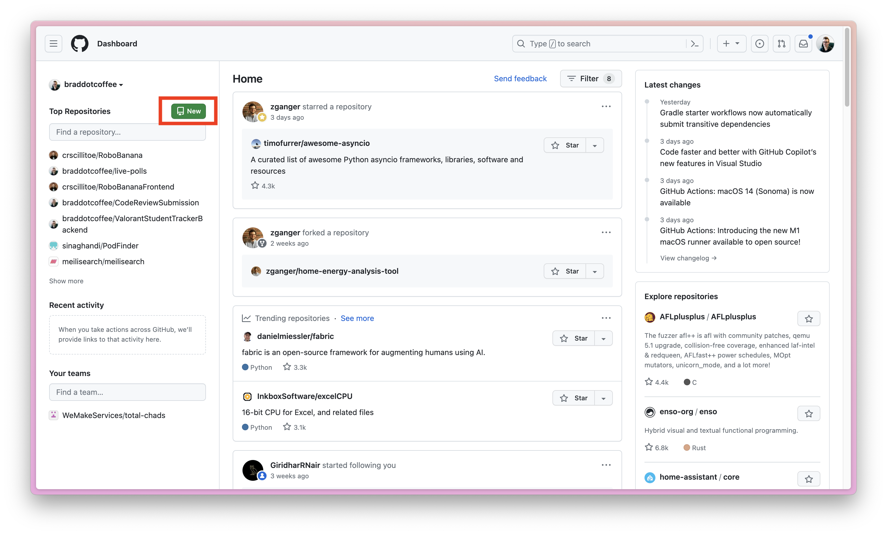
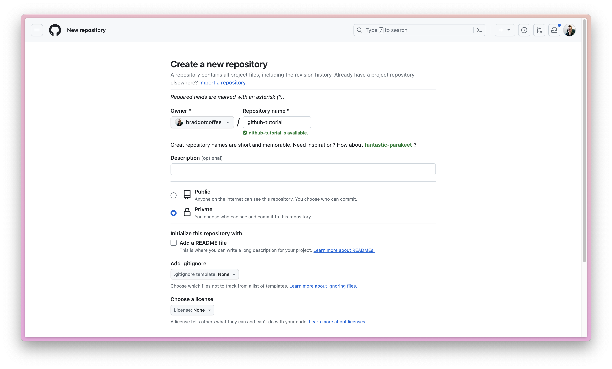
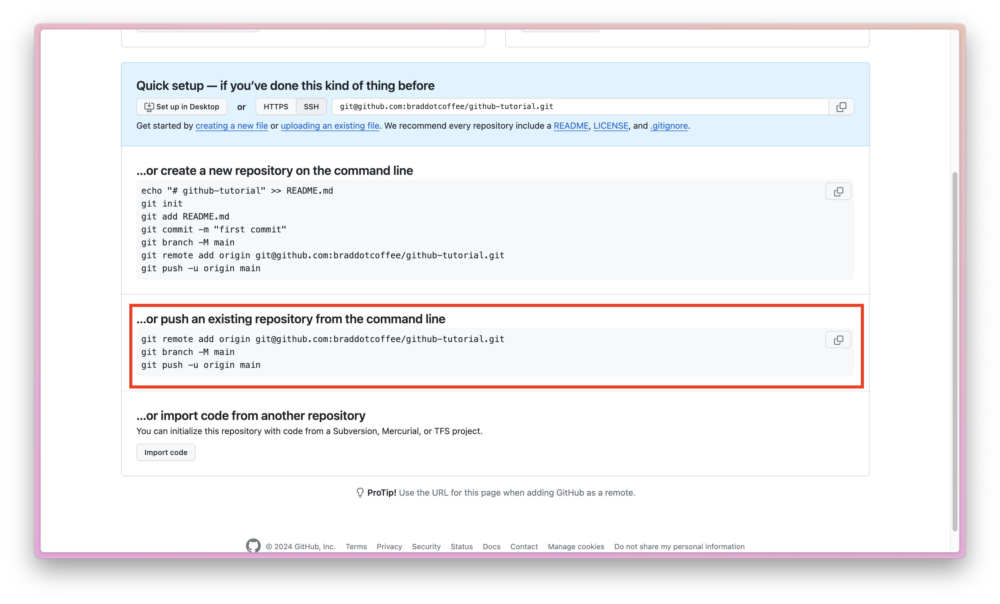
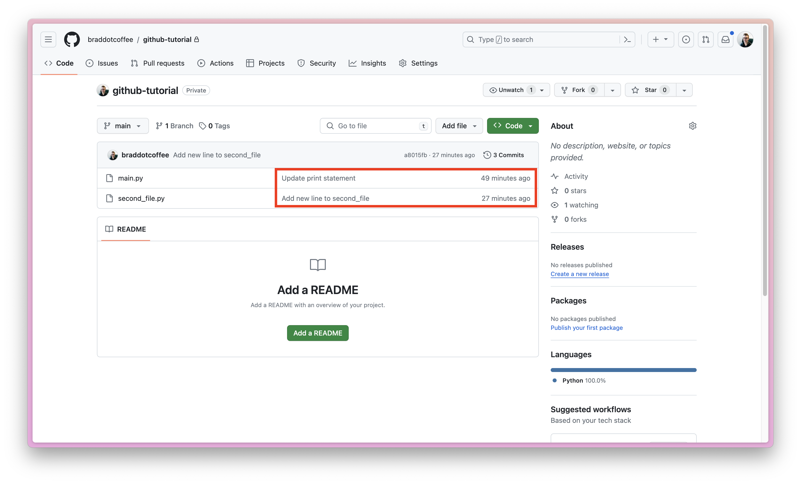

# GitHub and Version Control

For larger projects, it's highly recommended to version control your codebase. At its core, version control is the foundation for collaboration in software engineering. This tutorial will explain the basic concepts behind version control as well as walk you through creating your first repository on GitHub.

## Table of Contents

- [What is Version Control?](#what-is-version-control)
- [Git: The Most Popular Version Control](#git-the-most-popular-version-control)
- [GitHub: Keep Your Repositories Online](#github-keep-your-repositories-online)

## What is Version Control?

Imagine you're writing an essay for an English class. You need to submit this essay for feedback throughout the course of the class. You might end up with files on your computer named:

- `EnglishEssay_FirstDraft.pdf`
- `EnglishEssay_SecondDraft.pdf`
- `EnglishEssay_FINAL.pdf`
- `EnglishEssay_FINAL (1).pdf`
- `EnglishEssay_FINAL_FINAL.pdf`
- `EnglishEssay_FINAL_FINAL_SUBMIT-THIS-ONE.pdf`

Each file represents a different "snapshot" of your work. Here, you're assigning names to different "versions" of your essay. Version control for code operates in a similar way, but with a more elegant interface.

## Commits: A Changeset and a Snapshot

The core "building block" of source code version control is the "commit". Commits can be thought of in two lights: as a snapshot of your work, and as a "changeset".

Consider the English essay example from above. You can think of each iteration from `FirstDraft` to `FINAL_FINAL_SUBMIT-THIS-ONE` as a commit. By opening any of these files, you can view the exact state of your essay from when you hit `File > Save As`. For source code versioning, you can _also_ view the exact state of your codebase at any commit. When you choose to "commit" your code, it is analogous to this `File > Save As` process.

### So what is a "changeset" and how does it relate to a commit?

Let's create a simplified example of this English essay process. We start from a blank document.

```

```

We then begin to write our introduction.

```diff
+ In this essay I will talk about ducks.
```

You `File > Save As > FirstDraft`. After some quick back and forth with your teacher, you realize you haven't been cliche enough, so you decide to really up your intro game.

```diff
- In this essay I will talk about ducks.
+ Webster's dictionary defines duck as...
```

We delete our original introduction, and replace it with a far superior opening line. This is visually shown above as a "changeset" or "diff" - a representation of what **changed** between our two versions.

As you can imagine, this actually looks far more intuitive with code.

```diff
+ print("About to run loop")
  for i in range(10):
      print(i)
+ print("Done with loop")
```

```diff
  print("About to run loop")
  for i in range(10):
-     print(i)
+     print(f"{i=}")
  print("Done with loop")
```

```diff
- print("About to run loop")
  for i in range(10):
      print(f"{i=}")
  print("Done with loop")
```

Final code version:

```python
for i in range(10):
    print(f"{i=}")
print("Done with loop")
```

At any point we can "save" one of these changesets - into a commit.

### Why is a commit a changeset rather than a snapshot?

When you save your English essay with a new name, you are creating a snapshot of your work at an exact moment in time. When you commit your code, you are creating a snapshot of **changes** that you've made to your code. This is a subtle difference that is quite impactful for code maintainability.

An important detail is that commits come with "titles" and "descriptions". This allows a code author to describe their changes **and why they were made**. Consider the following diff:

```diff
+ if not user.logged_in:
+     return []
  return user.get_notes()
```

There are many reasons that we may see this code change. A commit allows us to describe the _exact motivation_ we had at the time of writing the code.

```
Verify user is logged in before retrieving notes

The user.get_notes() method assumes that a user is logged in.
If the method is called on a user who is logged out, an exception is thrown.
A user who is not logged in should simply see no notes.
```

When working on more complex projects and collaborating with other engineers, this ability to attach meaning to your code changes is **extremely powerful**.

### What about viewing a snapshot of our codebase?

Worry not - even though a commit is a changeset (or diff) of your code rather than a snapshot of your entire codebase, it is still possible to view your entire codebase at that commit. In this way version control provides us two tools for the price of one: convenient snapshots of our codebase AND documentation around _why_ changes were made.

## Git: The Most Popular Version Control

We've established the power of version control. Let's take a look at how this process works in practicality.

### Installing Git

Follow the [official Git installation guide](https://git-scm.com/book/en/v2/Getting-Started-Installing-Git) to make sure that you have Git installed on your system before getting started. If you're on Windows, make sure that you have Git Bash installed to follow along. Commands should shown below should be run in Git Bash on Windows.

### Initial Git Setup

To ensure following this tutorial goes smoothly, make sure to complete the "Your Identity" section of the [First Time Git Setup Guide](https://git-scm.com/book/en/v2/Getting-Started-First-Time-Git-Setup).

### Using Git

Lets make a new git "repository" - a codebase that is being tracked by git for version control.

```sh
mkdir git-tutorial
cd git-tutorial
git init
```

We're now ready to start adding code to our repository. Let's add a new Python file.

**main.py**

```python
print("Hello, world!")
print("We're here in our git tutorial")
```

For good measure, let's create a second Python file as well.

**second_file.py**

```python
print("Here we are in second file")
```

Now let's use the git CLI to check what's changed in our repository.

```sh
$ git status
On branch master

No commits yet

Untracked files:
  (use "git add <file>..." to include in what will be committed)
        main.py
        second_file.py

nothing added to commit but untracked files present (use "git add" to track)
```

Here we see two new "untracked" files. This means we have not yet told git that it should care about tracking the these files in our codebase. Let's do that now.

```sh
git add -A
```

We have now added all files in our repository to be tracked by git. We can verify this with another `git status` command.

```sh
$ git status
On branch master

No commits yet

Changes to be committed:
  (use "git rm --cached <file>..." to unstage)
        new file:   main.py
        new file:   second_file.py
```

Let's commit these two files to our repository to save them in their current state.

```sh
$ git commit -m "Created main and second_file"

[master (root-commit) e73c804] Created main and second_file for learning purposes
 2 files changed, 3 insertions(+)
 create mode 100644 main.py
 create mode 100644 second_file.py
```

We can see how git internalized these changes with `git show`.

```sh
$ git show
Author: [redacted] <redacted@gmail.com>
Date:   Fri Feb 2 23:13:22 2024 +0000

    Created main and second_file for learning purposes
```

```diff
diff --git a/main.py b/main.py
new file mode 100644
index 0000000..fe148d9
--- /dev/null
+++ b/main.py
@@ -0,0 +1,2 @@
+print("Hello, world!")
+print("We're here in our git tutorial")
diff --git a/second_file.py b/second_file.py
new file mode 100644
index 0000000..2740123
--- /dev/null
+++ b/second_file.py
@@ -0,0 +1 @@
+print("Here we are in second file")
```

Reading these diffs will get easier over time. The main takeaway here is that we created two files, and you can see their contents are present in the diff. Let's make another code change.

**main.py**

```python
print("Hello, world!")
print("We're here completing our git tutorial")
```

Before even committing, we can now check what we've changed in our codebase!

```sh
$ git diff
```

```diff
diff --git a/main.py b/main.py
index fe148d9..a29d3c2 100644
--- a/main.py
+++ b/main.py
@@ -1,2 +1,2 @@
 print("Hello, world!")
-print("We're here in our git tutorial")
+print("We're here completing our git tutorial")
```

Here we notice that git only tracks changes at the **line** level of granularity. Let's commit this change.

```sh
$ git add -A
$ git commit -m "Update print statement"

[master 81f2d10] Update print statement
 1 file changed, 1 insertion(+), 1 deletion(-)
```

Now let's say that we want to **temporarily view** what our codebase looked like at the point of our first commit. It's time to `checkout` that commit.

We'll start by finding our commit ID using `git log`. This command will list our commits back to us, most recent commit first.

```sh
$ git log
commit 81f2d1067fd8e006e76b54b3f99804db36430362 (HEAD -> master)
Author: redacted <redacted@gmail.com>
Date:   Fri Feb 2 23:23:04 2024 +0000

    Update print statement

commit e73c804a35b46f642d387ca6b758ba2aacb2d99c
Author: [redacted] <redacted@gmail.com>
Date:   Fri Feb 2 23:13:22 2024 +0000

    Created main and second_file for learning purposes
```

The long alphanumeric number after "commit" in this output is the commit ID of each of our two commits. Let's copy this ID and use it with `git checkout`.

```sh
git checkout e73c804a35b46f642d387ca6b758ba2aacb2d99c
```

Git will give you some warnings about "being in a detached HEAD state" - ignore these for now. If we open up our `main.py`, we can see its contents are now identical to during our initial commit.

**main.py**

```python
print("Hello, world!")
print("We're here in our git tutorial")
```

Let's go back to the "up to date" representation of our code. This command will make more sense after our next section.

```sh
git checkout master
```

If we open `main.py`, we can verify that we're back after our second commit.

**main.py**

```python
print("Hello, world!")
print("We're here completing our git tutorial")
```

### Git Branches

Sometimes when writing code, you may not want to immediately consider your changes "part of the codebase". There are tons and tons of reasons why this might be, but let's not get bogged down in "why" before we understand how branches are used.

If you're closely reading the output of the commands we're running, you have probably noticed references to "master". This is the default branch of our repository. This is what we will treat as "our official codebase". Any other branch will be considered "works in progress". Let's create one of those branches now.

```sh
$ git checkout -b update-second-file
Switched to a new branch 'update-second-file'
```

You can likely tell where this is going from the title of our branch. Let's add a new line to `second_file.py`

**second_file.py**

```python
print("Here we are in second file")
print("Here is a new line!")
```

Let's commit this change. You may eventually find it useful to know that you can stage individual files for commit like so.

```sh
$ git add second_file.py
$ git status

On branch update-second-file
Changes to be committed:
  (use "git restore --staged <file>..." to unstage)
        modified:   second_file.py

$ git commit -m "Add new line to second_file"

[update-second-file 4e1f4ad] Add new line to second_file
 1 file changed, 1 insertion(+)
```

Now we can see the power of branches in action. Let's check our current log of commits.

```sh
$ git log
commit a8015fbe3ded2be035e739cd34ec872215888d5b (HEAD -> update-second-file)
Author: [redacted] <redacted@gmail.com>
Date:   Fri Feb 2 23:43:53 2024 +0000

    Add new line to second_file

commit 81f2d1067fd8e006e76b54b3f99804db36430362 (master)
Author: [redacted] <redacted@gmail.com>
Date:   Fri Feb 2 23:23:04 2024 +0000

    Update print statement

commit e73c804a35b46f642d387ca6b758ba2aacb2d99c
Author: [redacted] <redacted@gmail.com>
Date:   Fri Feb 2 23:13:22 2024 +0000

    Created main and second_file for learning purposes
```

If we checkout our master branch, we can see that our newest commit is gone!

```sh
$ git checkout master
Switched to branch 'master
$ git log

commit 81f2d1067fd8e006e76b54b3f99804db36430362 (HEAD -> master)
Author: [redacted] <redacted@gmail.com>
Date:   Fri Feb 2 23:23:04 2024 +0000

    Update print statement

commit e73c804a35b46f642d387ca6b758ba2aacb2d99c
Author: [redacted] <redacted@gmail.com>
Date:   Fri Feb 2 23:13:22 2024 +0000

    Created main and second_file for learning purposes
```

We can change back to our "work in progress" changes at any point by checking out `update-second-file`.

```sh
$ git checkout update-second-file
Switched to branch 'update-second-file'
```

Once we're ready to consider these changes "part of our codebase", or "complete", we can `merge` this branch into master.

```sh
$ git checkout master
Switched to branch 'master'
$ git merge update-second-file

Updating 81f2d10..a8015fb
Fast-forward
 second_file.py | 1 +
 1 file changed, 1 insertion(+)

$ git log
commit a8015fbe3ded2be035e739cd34ec872215888d5b (HEAD -> master, update-second-file)
Author: [redacted] <redacted@gmail.com>
Date:   Fri Feb 2 23:43:53 2024 +0000

    Add new line to second_file

commit 81f2d1067fd8e006e76b54b3f99804db36430362
Author: [redacted] <redacted@gmail.com>
Date:   Fri Feb 2 23:23:04 2024 +0000

    Update print statement

commit e73c804a35b46f642d387ca6b758ba2aacb2d99c
Author: [redacted] <redacted@gmail.com>
Date:   Fri Feb 2 23:13:22 2024 +0000

    Created main and second_file for learning purposes
```

Since we have merged our changes into master, we can delete `update-second-file`.

```sh
$ git branch -D update-second-file
Deleted branch update-second-file (was a8015fb).
```

This process makes up the basis of the normal software development lifecycle.

1. Checkout a new branch for your potential changes
2. Make commits on this branch until they are "ready" or "complete"
3. Merge those commits into "master" or "main" (the default branch of your repository)

## GitHub: Keep Your Repositories Online

In the same way that Google Drive lets you upload your `EnglishEssay_FINAL.pdf` for yourself and others to access, GitHub lets you upload your git repositories to the internet. There are other options available for this functionality (e.g. GitLab, BitBucket, etc.) but none are quite as popular as GitHub.

Head over to [github.com](https://github.com) and make an account. Once you have an account, we're free to make our first repository to "back up" what we've done locally!

### Make an empty repository

With an entirely fresh account, your GitHub landing page may look slgihtly different than mine. On the top left, find the green "New" button to create a new repository (or head over to [github.com/new](https://github.com/new))


Name this repository "git-tutorial" and mark it as Private. Leave all other fields blank and click "Create Repository" at the bottom.


Here, GitHub conveniently gives us the commands to "push" our existing repository!


This will

1. Tell git that we want to remotely back up our code to GitHub. Colloquially we name this remote "origin".
1. Rename our `master` branch to `main` - this is GitHub's default branch name
1. Push our code changes to GitHub!

Run the commands inside our `git-tutorial` repo and refresh your GitHub page. You can see our code **and commit history** on GitHub! Note our commit messages and commit timestamps next to each file.


Feel free to click around and explore GitHub! There are a lot of cool built-in features - too many to cover here. Happy Version Controlling!
